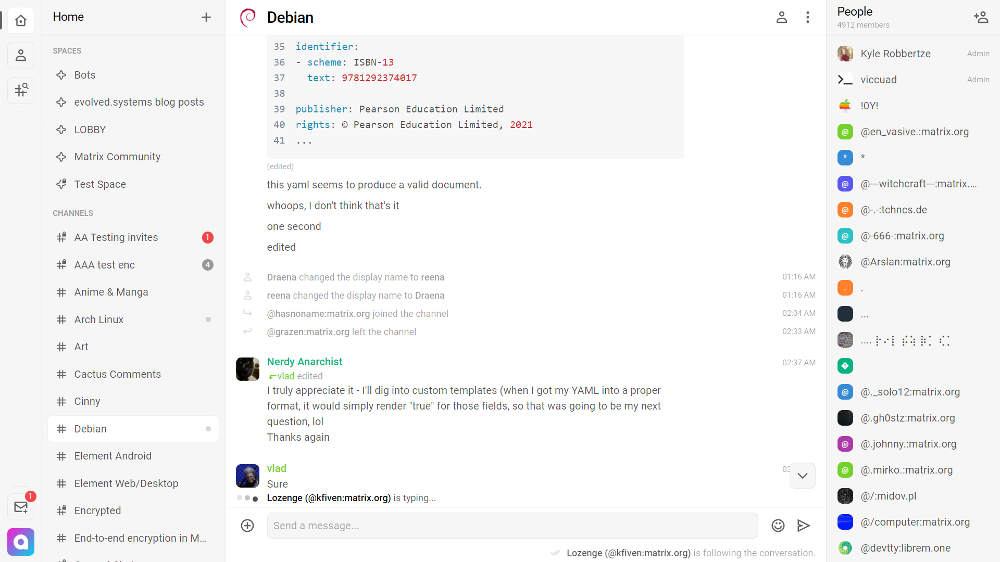

<!--
N.B.: Aquest README ha estat generat automàticament per <https://github.com/YunoHost/apps/tree/master/tools/readme_generator>
NO s'ha de modificar manualment.
-->

# Cinny per YunoHost

[](https://ci-apps.yunohost.org/ci/apps/cinny/)


[](https://install-app.yunohost.org/?app=cinny)

*[Llegeix aquest README en altres idiomes.](./ALL_README.md)*

> *Aquest paquet et permet instal·lar Cinny de forma ràpida i senzilla en un servidor YunoHost.*  
> *Si no tens YunoHost, consulta [la guia](https://yunohost.org/install) per saber com instal·lar-lo.*

## Visió general

A Matrix client focusing primarily on simple, elegant and secure interface.

### Features

- A nice and clean interface
- End-to-end Matrix encryption support
- Matrix Spaces support


**Versió inclosa:** 4.6.0~ynh1

**Demo:** <https://app.cinny.in>

## Captures de pantalla



## Documentació i recursos

- Lloc web oficial de l'aplicació: <https://cinny.in>
- Repositori oficial del codi de l'aplicació: <https://github.com/cinnyapp/cinny>
- Botiga YunoHost: <https://apps.yunohost.org/app/cinny>
- Reportar un error: <https://github.com/YunoHost-Apps/cinny_ynh/issues>

## Informació per a desenvolupadors

Envieu les pull request a la [branca `testing`](https://github.com/YunoHost-Apps/cinny_ynh/tree/testing).

Per provar la branca `testing`, procedir com descrit a continuació:

```bash
sudo yunohost app install https://github.com/YunoHost-Apps/cinny_ynh/tree/testing --debug
o
sudo yunohost app upgrade cinny -u https://github.com/YunoHost-Apps/cinny_ynh/tree/testing --debug
```

**Més informació sobre l'empaquetatge d'aplicacions:** <https://yunohost.org/packaging_apps>
