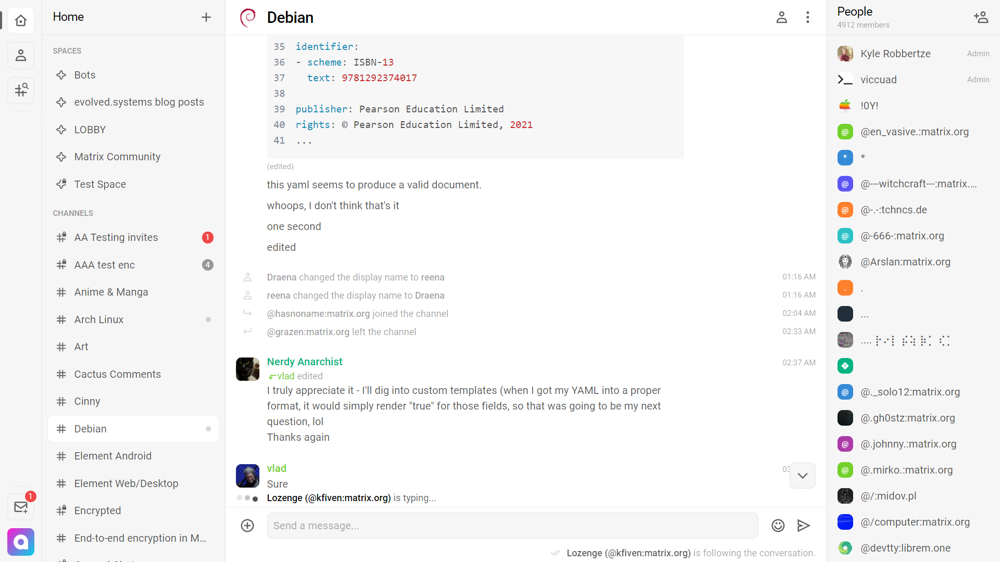

<!--
Ohart ongi: README hau automatikoki sortu da <https://github.com/YunoHost/apps/tree/master/tools/readme_generator>ri esker
EZ editatu eskuz.
-->

# Cinny YunoHost-erako

[](https://dash.yunohost.org/appci/app/cinny)  

[](https://install-app.yunohost.org/?app=cinny)

*[Irakurri README hau beste hizkuntzatan.](./ALL_README.md)*

> *Pakete honek Cinny YunoHost zerbitzari batean azkar eta zailtasunik gabe instalatzea ahalbidetzen dizu.*  
> *YunoHost ez baduzu, kontsultatu [gida](https://yunohost.org/install) nola instalatu ikasteko.*

## Aurreikuspena

A Matrix client focusing primarily on simple, elegant and secure interface.

### Features

- A nice and clean interface
- End-to-end Matrix encryption support
- Matrix Spaces support


**Paketatutako bertsioa:** 3.2.0~ynh2

**Demoa:** <https://app.cinny.in>

## Pantaila-argazkiak



## Dokumentazioa eta baliabideak

- Aplikazioaren webgune ofiziala: <https://cinny.in>
- Jatorrizko aplikazioaren kode-gordailua: <https://github.com/ajbura/cinny>
- YunoHost Denda: <https://apps.yunohost.org/app/cinny>
- Eman errore baten berri: <https://github.com/YunoHost-Apps/cinny_ynh/issues>

## Garatzaileentzako informazioa

Bidali `pull request`a [`testing` abarrera](https://github.com/YunoHost-Apps/cinny_ynh/tree/testing).

`testing` abarra probatzeko, ondorengoa egin:

```bash
sudo yunohost app install https://github.com/YunoHost-Apps/cinny_ynh/tree/testing --debug
edo
sudo yunohost app upgrade cinny -u https://github.com/YunoHost-Apps/cinny_ynh/tree/testing --debug
```

**Informazio gehiago aplikazioaren paketatzeari buruz:** <https://yunohost.org/packaging_apps>
