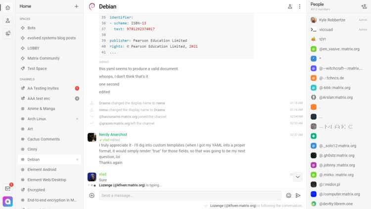

# Cinny pour YunoHost

[](https://dash.yunohost.org/appci/app/cinny)    
[](https://install-app.yunohost.org/?app=cinny)

*[Read this readme in english.](./README.md)*
*[Lire ce readme en français.](./README_fr.md)*

> *Ce package vous permet d'installer Cinny rapidement et simplement sur un serveur YunoHost.
Si vous n'avez pas YunoHost, regardez [ici](https://yunohost.org/#/install) pour savoir comment l'installer et en profiter.*

## Vue d'ensemble

Un client matrix orienté simplicité, élégance et sécurité.

### Features

- Une interface propre et claire
- Support du chiffrement Matrix pair-à-pair
- Support des "Espaces" Matrix


**Version incluse :** 1.3.0~ynh1

**Démo :** https://app.cinny.in

## Captures d'écran



## Avertissements / informations importantes

* L'application supporte uniquement d'être installée à la racine d'un domaine. C'est une limitation du logiciel.
    * ok: mydomain.org/
    * ok: cinny.mydomain.org/
    * NOT ok: mydomain.org/cinny

* Il n'y a pas de support LDAP (et il n'y en aura jamais)
* Cinny est uniquement un client Matrix, vous avez besoin d'un compte déjà existant sur un serveur (Yunohost propose une appli de serveur Synapse)

## Documentations et ressources

* Site officiel de l'app : https://cinny.in
* Documentation officielle utilisateur : https://cinny.in
* Documentation officielle de l'admin : https://cinny.in
* Dépôt de code officiel de l'app : https://github.com/ajbura/cinny
* Documentation YunoHost pour cette app : https://yunohost.org/app_cinny
* Signaler un bug : https://github.com/YunoHost-Apps/cinny_ynh/issues

## Informations pour les développeurs

Merci de faire vos pull request sur la [branche testing](https://github.com/YunoHost-Apps/cinny_ynh/tree/testing).

Pour essayer la branche testing, procédez comme suit.
```
sudo yunohost app install https://github.com/YunoHost-Apps/cinny_ynh/tree/testing --debug
ou
sudo yunohost app upgrade cinny -u https://github.com/YunoHost-Apps/cinny_ynh/tree/testing --debug
```

**Plus d'infos sur le packaging d'applications :** https://yunohost.org/packaging_apps